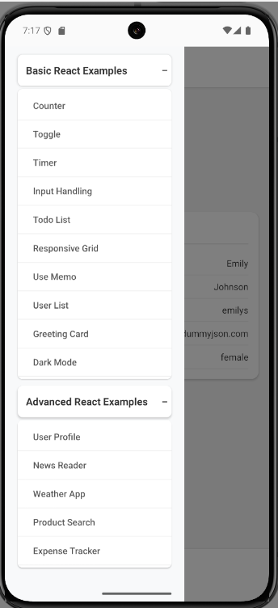

# React Native Assignment

A comprehensive React Native application showcasing both basic and advanced React patterns with multiple feature demonstrations.

## 📱 Advanced React Examples

### ExpenseTracker
Complete expense management system with SQLite database, pie charts, backup/restore functionality, and swipe-to-delete features.
Demonstrates advanced state management, file operations, database integration, and data visualization.

### ProductList  
Product filtering and search interface with modal forms and category-based filtering.
Shows complex form handling, modal management, and dynamic filtering capabilities.

### NewsReader
News article reader with API integration and responsive design.
Illustrates HTTP requests, data fetching, and content presentation patterns.

### Weather
Weather application with location-based forecasts and multiple city support.
Demonstrates geolocation services, API integration, and weather data visualization.

### Login
Authentication system with form validation and secure login flow.
Shows form validation, secure storage, and authentication state management.

## 🔧 Basic React Examples

- **Counter**: Simple state management with increment/decrement functionality
- **DarkMode**: Theme switching between light and dark modes
- **Forms**: Input handling and form validation demonstrations
- **GreetingCard**: Component composition and props handling
- **Memo**: React.memo and useMemo optimization examples
- **ResponsiveGrid**: Responsive layout and grid system implementation
- **Timer**: useEffect and interval management with countdown functionality
- **Todo**: Task management with add, delete, and toggle completion
- **Toggle**: Boolean state management and conditional rendering
- **Users**: User list display with data mapping and presentation

## 📚 Key Libraries Used

**react-native-sqlite-storage**: Local database storage for persistent data management.
Enables offline-first architecture with complex queries and data relationships.

**react-native-chart-kit**: Data visualization library for creating interactive charts and graphs.
Provides pie charts, bar charts, and line graphs with customizable styling and animations.

**react-native-swipe-list-view**: Enhanced list component with swipe gestures and actions.
Offers performance optimization for large datasets with smooth swipe-to-delete functionality.

**react-native-toast-message**: User-friendly notification system for app feedback.
Delivers non-intrusive success, error, and info messages with customizable positioning.

**react-native-fs**: File system operations for backup, restore, and data export features.
Handles document storage, file validation, and cross-platform file management.

## 📸 Screenshots



## 🚀 How to Run

### Prerequisites
- Node.js (v16+)
- React Native CLI
- Android Studio / Xcode

### Installation & Setup
```bash
# Clone the repository
git clone https://github.com/saxenam25/react-native-assignment.git
cd react-native-assignment

# Install dependencies
npm install

# iOS dependencies (iOS only)
cd ios && pod install && cd ..

# Start Metro bundler
npx react-native start
```

### Run on Device/Emulator
```bash
# Android
npx react-native run-android

# iOS
npx react-native run-ios
```

## 🏗️ Build for Production

### Android APK
```bash
# Generate release APK
cd android
./gradlew assembleRelease

# APK location: android/app/build/outputs/apk/release/
```

### iOS Archive
```bash
# Open Xcode workspace
open ios/MyApp.xcworkspace

# Product → Archive → Distribute App
```

---
**Built with React Native & TypeScript** | **Author**: [@saxenam25](https://github.com/saxenam25)

