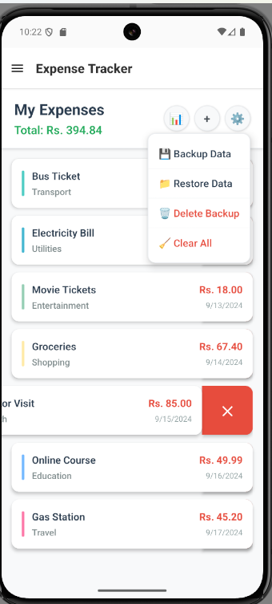
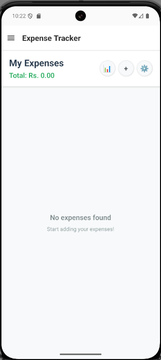

# React Native Assignment

A comprehensive React Native application showcasing both basic and advanced React patterns with multiple feature demonstrations.


## 📸 Screenshots

<table>
  <tr>
    <td></td>
    <td></td>
    <td></td>
    <td></td>
  </tr>
  <tr>
    <td></td>
    <td></td>
    <td></td>
    <td></td>
  </tr>
  <tr>
    <td></td>
    <td></td>
     <td></td>
      <td></td>
    <td></td>
    <td></td>
  </tr>
   <tr>
    <td></td>
    <td></td>
    <td></td>
    <td></td>
  </tr>
</table>


## 🎯 Concepts Covered

### Authentication & Storage
- **Auto Login Feature**: Automatic user authentication using stored tokens with AsyncStorage validation
- **Secure Token Management**: JWT token storage using encrypted storage for sensitive authentication data
- **Logout Functionality**: Complete session cleanup with token removal from both encrypted and async storage
- **Persistent User Sessions**: Maintaining login state across app restarts with secure token validation

### API Integration & Data Management
- **Public API Consumption**: Integration with open APIs for weather data, news feeds, and external services
- **HTTP Request Handling**: GET, POST, PUT, DELETE operations with proper error handling and loading states
- **Data Caching**: Smart caching strategies for offline functionality and improved performance
- **Real-time Updates**: Live data synchronization and automatic refresh mechanisms

### Advanced UI/UX Patterns
- **Infinite Scroll**: Pagination implementation with automatic loading of additional content on scroll
- **Pull to Refresh**: Native refresh functionality with loading indicators and data synchronization
- **Swipe Gestures**: Swipe-to-delete, swipe actions, and gesture-based navigation patterns
- **Modal Management**: Complex modal workflows with form validation and state management

### Database & File Operations
- **SQLite Integration**: Local database with CRUD operations, migrations, and complex queries
- **File System Management**: Backup/restore functionality with JSON export/import capabilities
- **Data Validation**: Input sanitization, form validation, and data integrity checks
- **Bulk Operations**: Efficient batch processing for large datasets and database operations

### Performance & Optimization
- **React.memo & useMemo**: Component and computation memoization for performance optimization
- **List Virtualization**: Efficient rendering of large lists with react-native-swipe-list-view
- **State Management**: Complex state handling with useState, useEffect, and custom hooks
- **Memory Management**: Proper cleanup of resources, timers, and event listeners

### Cross-Platform Features
- **Responsive Design**: Adaptive layouts that work across different screen sizes and orientations
- **Platform-Specific Code**: Handling iOS and Android differences in permissions and native features
- **Navigation Patterns**: Screen transitions, tab navigation, and deep linking implementation
- **Theme Management**: Dark/light mode switching with persistent user preferences

## 📁 Folder Structure

```
src/
├── screens/
│   ├── basic-react-examples/
│   │   ├── Counter/
│   │   │   ├── CounterScreen.tsx        # Simple state management
│   │   │   └── Counter.style.ts         # Counter styling
│   │   ├── DarkMode/
│   │   │   ├── DarkModeScreen.tsx       # Theme switching
│   │   │   └── DarkMode.style.ts        # Dark mode styling
│   │   ├── Forms/
│   │   │   ├── InputHandlingScreen.tsx  # Input handling & validation
│   │   │   └── Forms.style.ts           # Form styling
│   │   ├── GreetingCard/
│   │   │   ├── GreetingCardScreen.tsx   # Component composition
│   │   │   ├── CardComponent.tsx        # Card component
│   │   │   └── GreetingCard.style.ts    # Card styling
│   │   ├── Memo/
│   │   │   ├── UseMemoScreen.tsx        # Performance optimization
│   │   │   ├── UseMemoChildComponent.tsx # Child component
│   │   │   └── Memo.style.ts            # Memo styling
│   │   ├── NewsReader/
│   │   │   ├── NewsReaderScreen.tsx     # Basic news reader
│   │   │   └── NewsReader.style.ts      # News styling
│   │   ├── ResponsiveGrid/
│   │   │   ├── ResponsiveGridScreen.tsx # Responsive layouts
│   │   │   └── ResponsiveGrid.style.ts  # Grid styling
│   │   ├── Timer/
│   │   │   ├── TimerScreen.tsx          # useEffect & intervals
│   │   │   └── Timer.style.ts           # Timer styling
│   │   ├── Todo/
│   │   │   ├── TodoScreen.tsx           # Task management
│   │   │   └── Todo.style.ts            # Todo styling
│   │   ├── Toggle/
│   │   │   ├── ToggleScreen.tsx         # Boolean state
│   │   │   └── Toggle.style.ts          # Toggle styling
│   │   └── Users/
│   │       ├── UserScreen.tsx           # Data mapping
│   │       └── Users.style.ts           # User styling
│   └── advanced-react-example/
│       ├── ExpenseTracker/
│       │   ├── ExpenseListScreen.tsx    # Main expense interface
│       │   ├── AddExpenseScreen.tsx     # Add expense modal
│       │   ├── ExpenseChartScreen.tsx   # Data visualization
│       │   ├── ExpenseFileManager.ts    # Backup/restore
│       │   ├── sqlite-expense-db.ts     # Database service
│       │   ├── ExpenseData.ts           # Types & utilities
│       │   └── Expense.style.ts         # Component styling
│       ├── Login/
│       │   ├── LoginScreen.tsx          # Main login interface
│       │   ├── AuthService.ts           # Authentication logic
│       │   └── Login.style.ts           # Login styling
│       ├── NewsReader/
│       │   ├── NewsReaderScreen.tsx     # News list interface
│       │   ├── NewsDetailScreen.tsx     # Article detail view
│       │   ├── NewsService.ts           # API integration
│       │   └── News.style.ts            # News styling
│       ├── ProductList/
│       │   ├── ProductListScreen.tsx    # Product list with filters
│       │   ├── ProductFilterModal.tsx   # Filter modal component
│       │   ├── ProductData.ts           # Product types & data
│       │   └── Product.style.ts         # Product styling
│       ├── Weather/
│       │   ├── WeatherDashboardScreen.tsx  # Main weather interface
│       │   ├── WeatherService.ts           # Weather API integration
│       │   ├── LocationService.ts          # GPS & location handling
│       │   └── Weather.style.ts            # Weather styling
│       └── UserProfileScreen.tsx        # User management
├── ui-components/
│   ├── PressableButton.tsx      # Reusable button
│   └── ToastComponent.tsx       # Custom notifications
├── core/
│   ├── asyncStorage.ts          # AsyncStorage utilities
│   ├── context/
│   │   └── AuthContext.tsx      # Authentication context
│   ├── navigation/
│   │   ├── navigation.tsx       # Main navigation
│   │   ├── route.config.ts      # Route configuration
│   │   └── DynamicNavigation.tsx # Dynamic navigation
│   └── services/
│       └── authentication.service.ts # Auth service
├── shared/
│   ├── hooks/
│   │   ├── useFetch.tsx         # Custom fetch hook
│   │   └── useLocation.tsx      # Location hook
│   └── types/
│       └── login.interface.ts   # Login type definitions
├── data.json                    # Static data
└── README.md                    # Project documentation
```

## 📱 Advanced React Examples

### ExpenseTracker
Complete expense management system with SQLite database, pie charts, backup/restore functionality, and swipe-to-delete features.
Demonstrates advanced state management, file operations, database integration, and data visualization.

### ProductList  
Product filtering and search interface with modal forms and category-based filtering.
Shows complex form handling, modal management, and dynamic filtering capabilities.

### NewsReader
News article reader with API integration and responsive design.
Illustrates HTTP requests, data fetching, and content presentation patterns.

### Weather
Weather application with location-based forecasts and multiple city support.
Demonstrates geolocation services, API integration, and weather data visualization.

### Login
Authentication system with form validation and secure login flow.
Shows form validation, secure storage, and authentication state management.

## 🔧 Basic React Examples

- **Counter**: Simple state management with increment/decrement functionality
- **DarkMode**: Theme switching between light and dark modes
- **Forms**: Input handling and form validation demonstrations
- **GreetingCard**: Component composition and props handling
- **Memo**: React.memo and useMemo optimization examples
- **ResponsiveGrid**: Responsive layout and grid system implementation
- **Timer**: useEffect and interval management with countdown functionality
- **Todo**: Task management with add, delete, and toggle completion
- **Toggle**: Boolean state management and conditional rendering
- **Users**: User list display with data mapping and presentation

## 📚 Key Libraries Used

**react-native-sqlite-storage**: Local database storage for persistent data management.
Enables offline-first architecture with complex queries and data relationships.

**react-native-chart-kit**: Data visualization library for creating interactive charts and graphs.
Provides pie charts, bar charts, and line graphs with customizable styling and animations.

**react-native-swipe-list-view**: Enhanced list component with swipe gestures and actions.
Offers performance optimization for large datasets with smooth swipe-to-delete functionality.

**react-native-toast-message**: User-friendly notification system for app feedback.
Delivers non-intrusive success, error, and info messages with customizable positioning.

**react-native-fs**: File system operations for backup, restore, and data export features.
Handles document storage, file validation, and cross-platform file management.

**@react-native-async-storage/async-storage**: Simple, unencrypted, asynchronous storage for React Native.
Provides persistent key-value storage for user preferences, settings, and app state management.

**react-native-encrypted-storage**: Secure storage solution for sensitive data like tokens and credentials.
Offers encrypted storage with keychain/keystore integration for maximum security on both platforms.

**react-native-geolocation-service**: Location services with high accuracy and background support.
Enables GPS functionality, location tracking, and geofencing with proper permission handling.

## 🚀 How to Run

### Prerequisites
- Node.js (v16+)
- React Native CLI
- Android Studio / Xcode

### Installation & Setup
```bash
# Clone the repository
git clone https://github.com/saxenam25/react-native-assignment.git
cd react-native-assignment

# Install dependencies
npm install

# iOS dependencies (iOS only)
cd ios && pod install && cd ..

# Start Metro bundler
npx react-native start
```

### Run on Device/Emulator
```bash
# Android
npx react-native run-android

# iOS
npx react-native run-ios
```

## 🏗️ Build for Production

### Android APK
```bash
# Generate release APK
cd android
./gradlew assembleRelease

# APK location: android/app/build/outputs/apk/release/
```

### iOS Archive
```bash
# Open Xcode workspace
open ios/MyApp.xcworkspace

# Product → Archive → Distribute App
```

---
**Built with React Native & TypeScript** | **Author**: [Mohit Saxena](https://github.com/saxenam25)

